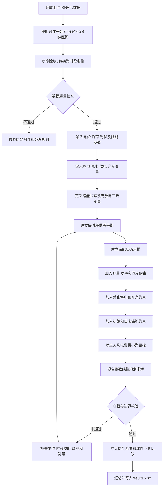

# 第一问数学模型完整建模说明

## 确定性单日微网购电与储能联合调度

本文针对第一问建立含充放电互斥、弃光变量、储能效率和终端电量约束的改进混合整数线性规划模型。模型以 10 分钟为决策粒度，在确保小区负荷完全满足、储能安全运行且日初日末电量相等的条件下，联合优化外部电网购电和储能充放电，使全天购电费用最小。

模型直接使用处理后的 144 条附件 1 数据。经质量检查，附件 1 不存在数值缺失、负功率、负电价或四分位距候选异常，因此不需要插值、删除或异常值替换；优化阶段保留千瓦、千瓦时和元/千瓦时等原始物理单位。

## 一 问题重述与模型选择

已知某日每隔 10 分钟的外部电网购电价格、小区负荷功率和光伏预测功率，以及储能容量、充放电功率、效率与初始电量。需要决定各时段的电网购电量、储能充电量、储能放电量、弃光量和储能状态。

所制定方案必须保证：

1. 每个时段的负荷均被完全满足；
2. 储能电量始终位于安全区间；
3. 充放电功率不超过额定功率；
4. 同一时段不能同时充电和放电；
5. 0:00 与 24:00 储能电量相等；
6. 全天购电费用最小。

除充放电状态互斥需要二元变量外，目标函数、供需平衡、储能递推、容量边界和功率约束均为线性关系，因此采用混合整数线性规划作为正式主模型，以无储能方案和线性松弛作为验证基准。

## 二 模型准备

### 2.1 时间离散与能量换算

将一天划分为 144 个连续的 10 分钟时段：

$$
\mathcal T=\{1,2,\ldots,144\}.
$$

单个时段长度为

$$
\Delta t=\frac{10}{60}=\frac16\ \mathrm{h}.
\tag{1}
$$

附件中负荷和光伏的单位为千瓦，而结果文件要求购电量和充放电量以千瓦时表示，因此进行功率到电量的转换：

$$
L_t=P_t^L\Delta t=\frac{P_t^L}{6},
\qquad
R_t=P_t^{PV}\Delta t=\frac{P_t^{PV}}{6}.
\tag{2}
$$

如果遗漏除以 6 的换算，储能状态和购电量会被放大 6 倍。

### 2.2 数据质量与使用原则

| 检查项目 | 处理后结果 | 建模处理 |
|---|---:|---|
| 总时段数 | 144 | 通过 |
| 数值型缺失记录 | 0 | 无需填补 |
| 四分位距候选异常 | 0 | 无需修正 |
| 负功率或负电价 | 0 | 通过 |
| 日期时段键 | 唯一 | 通过 |
| 优化变量是否标准化 | 否 | 保留物理量纲 |

距离类和机器学习预测模型可以使用标准分数，但第一问优化模型不得使用标准化后的功率或电量，否则储能边界和功率上限将失去物理意义。

### 2.3 处理后数据诊断

| 指标 | 数值 |
|---|---:|
| 全天负荷电量 | 111024.8081 千瓦时 |
| 全天光伏预测电量 | 55482.8357 千瓦时 |
| 负荷减光伏的代数和 | 55541.9724 千瓦时 |
| 最大正净负荷 | 826.0833 千瓦时/时段 |
| 最大光伏富余 | 352.9209 千瓦时/时段 |
| 光伏富余时段数 | 30 |
| 光伏富余总量 | 6247.9630 千瓦时 |
| 最低电价 | 0.3713 元/千瓦时 |
| 最高电价 | 1.3952 元/千瓦时 |
| 无储能购电量基准 | 61789.9354 千瓦时 |
| 无储能购电费基准 | 48052.0466 元 |

无储能基准按正净负荷购电、负净负荷弃光计算：

$$
G_t^{(0)}=\max\{L_t-R_t,0\},
\qquad
W_t^{(0)}=\max\{R_t-L_t,0\}.
\tag{3}
$$

无储能基准只用于模型校验，不是最终调度结果。优化后的购电费用原则上不应高于 48052.0466 元。

## 三 参数与变量定义

### 3.1 模型参数

| 参数 | 含义 | 单位 | 数值或范围 |
|---|---|---|---|
| $t$ | 10 分钟时段序号 | 无 | $1,\ldots,144$ |
| $\Delta t$ | 单个时段长度 | 小时 | $1/6$ |
| $p_t$ | 第 $t$ 时段购电价格 | 元/千瓦时 | 附件 1 给定 |
| $P_t^L$ | 第 $t$ 时段负荷功率 | 千瓦 | 附件 1 给定 |
| $P_t^{PV}$ | 第 $t$ 时段光伏预测功率 | 千瓦 | 附件 1 给定 |
| $L_t$ | 第 $t$ 时段负荷电量 | 千瓦时 | $P_t^L/6$ |
| $R_t$ | 第 $t$ 时段可用光伏电量 | 千瓦时 | $P_t^{PV}/6$ |
| $E^{\min}$ | 储能安全下限 | 千瓦时 | 1200 |
| $E^{\mathrm{up}}$ | 储能安全上限 | 千瓦时 | 10800 |
| $E^0$ | 0:00 初始储能电量 | 千瓦时 | 6000 |
| $P^{ch,\max}$ | 最大充电功率 | 千瓦 | 5000 |
| $P^{dis,\max}$ | 最大放电功率 | 千瓦 | 5000 |
| $\bar q^{ch}$ | 每时段最大充电量 | 千瓦时 | 833.3333 |
| $\bar q^{dis}$ | 每时段最大放电量 | 千瓦时 | 833.3333 |
| $\eta_{ch}$ | 充电效率 | 无 | 0.90 |
| $\eta_{dis}$ | 放电效率 | 无 | 0.90 |

主方案将题目中的 90% 解释为充电效率和放电效率各为 90%，对应往返效率

$$
\eta_{rt}=\eta_{ch}\eta_{dis}=0.81.
\tag{4}
$$

若官方将 90% 定义为总往返效率，则采用

$$
\eta_{ch}=\eta_{dis}=\sqrt{0.9}\approx0.948683
\tag{5}
$$

作为敏感性方案。

### 3.2 决策变量 中间变量和目标变量

| 类别 | 符号 | 含义 | 类型 | 单位 | 约束范围 |
|---|---|---|---|---|---|
| 决策变量 | $g_t$ | 外部电网购电量 | 连续 | 千瓦时 | $0\le g_t\le L_t+833.3333$ |
| 决策变量 | $c_t$ | 储能交流侧充电量 | 连续 | 千瓦时 | $0\le c_t\le833.3333$ |
| 决策变量 | $d_t$ | 储能交流侧放电量 | 连续 | 千瓦时 | $0\le d_t\le833.3333$ |
| 决策变量 | $w_t$ | 弃光量 | 连续 | 千瓦时 | $0\le w_t\le R_t$ |
| 决策变量 | $u_t^{ch}$ | 是否允许充电 | 二元 | 无 | $\{0,1\}$ |
| 决策变量 | $u_t^{dis}$ | 是否允许放电 | 二元 | 无 | $\{0,1\}$ |
| 中间变量 | $E_t$ | 时段结束储能电量 | 连续 | 千瓦时 | $[1200,10800]$ |
| 中间变量 | $N_t$ | 未考虑储能的净负荷 | 连续 | 千瓦时 | $L_t-R_t$ |
| 中间变量 | $Q$ | 全天储能吞吐量 | 连续 | 千瓦时 | $Q\ge0$ |
| 目标变量 | $C_{grid}$ | 全天外部电网购电费 | 连续 | 元 | $C_{grid}\ge0$ |

$c_t$ 定义为交流母线送入储能的电量，$d_t$ 定义为储能送回交流母线的电量。因此，真正进入电池的能量为 $\eta_{ch}c_t$；为了向母线提供 $d_t$，电池内部需要减少 $d_t/\eta_{dis}$。

## 四 模型假设及合理性

| 假设 | 具体内容 | 合理性 |
|---|---|---|
| 一 | 第一问中的当天电价、负荷和光伏预测在决策时已知，作为确定性参数 | 第一问重点是建立单日基础调度框架，不要求研究预测误差 |
| 二 | 每个 10 分钟时段内负荷、光伏功率和电价保持为给定平均值 | 原始数据粒度为 10 分钟，分段常数假设与数据结构一致 |
| 三 | 允许弃光，但不允许向外部电网售电 | 题目没有给出售电价格；弃光变量保证光伏富余且储能已满时模型仍可行 |
| 四 | 外部电网能够提供足够的购电功率 | 题目未给电网容量上限；如取得上限，只需增加购电上界约束 |
| 五 | 除储能效率外，忽略线路损耗、自放电、温度变化和单日容量衰减 | 题目未给相关参数，且单日内影响相对有限 |

负荷必须完全满足属于题目强制条件，不作为可放宽假设。模型不设置负荷缺供变量。混合整数优化也不要求电价、负荷和光伏相互独立；需要验证的是时段索引唯一、数据对齐、量纲一致和约束可行。

## 五 核心公式推导

### 5.1 净负荷

定义不考虑储能时的净负荷：

$$
N_t=L_t-R_t.
\tag{6}
$$

- 当 $N_t>0$ 时，光伏不足，需要电网购电或储能放电；
- 当 $N_t<0$ 时，光伏富余，可以给储能充电或弃光。

当前数据存在 30 个光伏富余时段，因此必须显式描述富余电量的去向。

### 5.2 微网电量平衡

第 $t$ 时段进入交流母线的电量包括电网购电、可用光伏和储能放电；流出母线的电量包括小区负荷、储能充电和弃光，因此

$$
g_t+R_t+d_t=L_t+c_t+w_t,
\qquad t\in\mathcal T.
\tag{7}
$$

等价地，

$$
g_t+d_t-c_t-w_t=N_t.
\tag{8}
$$

弃光变量吸收无法利用的光伏余量，避免出现无去向的能量。

### 5.3 储能状态递推

考虑充电损耗和放电损耗，时段结束储能状态为

$$
E_t=E_{t-1}+\eta_{ch}c_t-\frac{d_t}{\eta_{dis}},
\qquad t=1,\ldots,144.
\tag{9}
$$

当充放电效率均为 0.9 时，交流侧充入 100 千瓦时仅使电池增加 90 千瓦时；若之后交流侧输出 81 千瓦时，电池恰好减少 90 千瓦时。效率不能同时在供需平衡式和状态方程中重复计算。

### 5.4 容量和功率约束

$$
1200\le E_t\le10800.
\tag{10}
$$

最大充放电功率换算为每 10 分钟最大电量：

$$
\bar q^{ch}=\bar q^{dis}=5000\times\frac16=833.3333\ \mathrm{kWh}.
\tag{11}
$$

储能实际可调节区间为

$$
10800-1200=9600\ \mathrm{kWh}.
\tag{12}
$$

初始电量 6000 千瓦时位于区间中点，上下可用空间均为 4800 千瓦时。

### 5.5 充放电互斥

$$
0\le c_t\le\bar q^{ch}u_t^{ch},
\tag{13}
$$

$$
0\le d_t\le\bar q^{dis}u_t^{dis},
\tag{14}
$$

$$
u_t^{ch}+u_t^{dis}\le1,
\qquad
u_t^{ch},u_t^{dis}\in\{0,1\}.
\tag{15}
$$

两个状态变量均为 0 时储能空闲；式（15）严格禁止同一时段同时充电和放电。

### 5.6 弃光与禁止售电

$$
0\le w_t\le R_t,
\qquad
g_t\ge0.
\tag{16}
$$

由供需平衡还可得到一个不改变可行域的紧购电上界：

$$
g_t\le L_t+\bar q^{ch}.
\tag{17}
$$

模型中没有售电变量，也不允许负购电量，因此富余电量只能用于负荷、储能充电或弃光。

### 5.7 初始和终端条件

$$
E_0=6000,
\qquad
E_{144}=E_0=6000.
\tag{18}
$$

若删除终端约束，模型会倾向于在最后的高价时段耗尽储能，将补能成本转移到下一日，导致当天费用虚低。

## 六 目标函数

### 6.1 主目标

全天购电费用为

$$
C_{grid}=\sum_{t=1}^{144}p_tg_t.
\tag{19}
$$

第一层目标为

$$
\min C_{grid}.
\tag{20}
$$

### 6.2 小额循环成本的严谨处理

题目没有给出电池折旧成本，不宜直接加入任意较大的循环费用。推荐采用两层词典序优化。

第一层先获得最小购电费：

$$
C^*=\min\sum_{t=1}^{144}p_tg_t.
\tag{21}
$$

第二层在购电费保持最优的条件下，使储能吞吐量最小：

$$
\min Q=\sum_{t=1}^{144}(c_t+d_t),
\tag{22}
$$

$$
\sum_{t=1}^{144}p_tg_t\le C^*+\varepsilon_{tol}.
\tag{23}
$$

这种处理不会改变题目的首要目标，却能在多个成本等价方案中选择充放电次数更少、无效循环更少的方案。

## 七 完整数学模型

$$
\begin{aligned}
\min\quad
&\sum_{t=1}^{144}p_tg_t\\
\text{约束于}\quad
&g_t+R_t+d_t=L_t+c_t+w_t, &&\forall t,\\
&E_t=E_{t-1}+\eta_{ch}c_t-\frac{d_t}{\eta_{dis}}, &&\forall t,\\
&1200\le E_t\le10800, &&\forall t,\\
&0\le c_t\le833.3333u_t^{ch}, &&\forall t,\\
&0\le d_t\le833.3333u_t^{dis}, &&\forall t,\\
&u_t^{ch}+u_t^{dis}\le1, &&\forall t,\\
&0\le w_t\le R_t, &&\forall t,\\
&0\le g_t\le L_t+833.3333, &&\forall t,\\
&E_0=6000,\quad E_{144}=6000,\\
&u_t^{ch},u_t^{dis}\in\{0,1\}.
\end{aligned}
\tag{24}
$$

模型包含 144 个购电变量、144 个充电变量、144 个放电变量、144 个弃光变量、144 个期末储能状态变量以及 288 个充放电状态二元变量。该规模较小，标准混合整数线性规划求解器可以快速获得全局最优解。

## 八 模型机理与可解释性

### 8.1 储能套利条件

若在低价时段 $i$ 从电网购电充入储能，并在高价时段 $j$ 释放，则不考虑折旧成本时，储能套利有利的条件为

$$
p_j\eta_{ch}\eta_{dis}>p_i.
\tag{25}
$$

当前最低电价为 0.3713 元/千瓦时，最高电价为 1.3952 元/千瓦时，并且

$$
0.81\times1.3952=1.1301>0.3713,
$$

因此低价充电、高价放电具有明显经济可行性。

### 8.2 全日能量守恒

将储能状态递推式在全天求和，并利用日初日末电量相等，得到

$$
\sum_{t=1}^{144}d_t
=
\eta_{ch}\eta_{dis}\sum_{t=1}^{144}c_t.
\tag{26}
$$

进一步将供需平衡式在全天求和，并代入处理后数据与 0.81 往返效率，得到

$$
\sum_{t=1}^{144}g_t
=55541.9724
+\sum_{t=1}^{144}w_t
+0.19\sum_{t=1}^{144}c_t.
\tag{27}
$$

其中第一项是全天负荷减去全部预测光伏，第二项是弃光造成的额外购电，第三项是储能循环损耗造成的额外购电。任何最终结果都应满足式（27）。

## 九 建模流程

关键检查包括：时段索引唯一、单位一致、参数外生和约束可行。优化决策变量不需要统计独立性假设。

## 十 具体建模与求解步骤

1. **载入处理后数据。** 读取每个时段的序号、电价、负荷功率和光伏预测功率，以时段序号作为唯一主键。
2. **完成单位统一。** 计算负荷电量和光伏电量，所有决策变量与储能状态统一使用千瓦时。
3. **建立决策变量。** 对每个时段建立购电、充电、放电、弃光、储能状态及充放电二元变量。
4. **加入供需平衡。** 逐时段加入能量平衡等式，强制所有负荷都被电网、光伏或储能满足。
5. **连接储能状态。** 从 $E_0=6000$ 出发，根据充放电量和效率递推 $E_1$ 至 $E_{144}$。
6. **加入运行约束。** 加入容量安全区间、功率上限、充放电互斥、弃光范围及禁止售电约束。
7. **加入终端条件。** 设置 $E_{144}=6000$，防止通过透支下一日储能人为降低成本。
8. **构造目标函数。** 第一层最小化全天购电费；存在等价最优方案时，第二层最小化储能吞吐量。
9. **求解模型。** 调用混合整数线性规划求解器，确认模型达到最优状态并满足设定精度。
10. **回代与输出。** 重新计算成本和约束残差，汇总指定时段与 4 小时充放电量，并写入 `result1.xlsx`。

## 十一 模型校验体系

### 11.1 逐时段平衡残差

$$
r_t^{bal}=g_t+R_t+d_t-L_t-c_t-w_t.
\tag{28}
$$

要求

$$
\max_t|r_t^{bal}|\le10^{-6}.
\tag{29}
$$

### 11.2 储能递推残差

$$
r_t^{soc}
=E_t-E_{t-1}-\eta_{ch}c_t+\frac{d_t}{\eta_{dis}}.
\tag{30}
$$

要求

$$
\max_t|r_t^{soc}|\le10^{-6}.
\tag{31}
$$

### 11.3 边界与互斥检查

- 全部储能状态满足 $1200\le E_t\le10800$；
- 日末状态满足 $E_{144}=6000$；
- 不存在充电量和放电量同时大于数值容差的时段；
- 所有购电量、充放电量和弃光量均非负；
- 逐时段重新计算的购电费用之和与求解器目标值一致。

### 11.4 基准与下界比较

去掉二元互斥变量或将其放松为 $[0,1]$ 内的连续变量，可以得到线性松弛下界。正确结果应满足

$$
C_{lower}\le C^*\le C_{no\ storage}=48052.0466\ \text{元}.
\tag{32}
$$

若最优购电费高于无储能基准，应重点检查效率是否重复计算、时段是否错位、终端条件是否错误以及充放电变量的符号方向。

## 十二 结果文件映射

| 输出内容 | 模型映射 |
|---|---|
| 每 10 分钟计划购电量 | 直接输出 $g_t$ |
| 题目指定时段购电量 | 读取对应时段的 $g_t$ |
| 全天购电量 | $\sum_tg_t$ |
| 全天购电费 | $\sum_tp_tg_t$ |
| 每个 4 小时块充电量 | 对时间块内 $c_t$ 求和 |
| 每个 4 小时块放电量 | 对时间块内 $d_t$ 求和 |
| 0:00 储能电量 | $E_0=6000$ |
| 24:00 储能电量 | $E_{144}=6000$ |

若第 $k$ 个 4 小时时间块包含时段集合 $\mathcal B_k$，则

$$
C_k^{ch}=\sum_{t\in\mathcal B_k}c_t,
\qquad
C_k^{dis}=\sum_{t\in\mathcal B_k}d_t.
\tag{33}
$$

## 十三 时段标签映射注意事项

原附件 1 的时刻从“00:10”开始，最后一条为“0:00+1”；处理后数据将最后一条规范为“24:00”。官方 `result1.xlsx` 模板区间从“0:10-0:20”开始，最后为“0:00+1-0:10+1”。实现时必须避免因文本标签造成整体错位。

1. 模型内部统一以时段序号 1 至 144 为主键；
2. 处理后数据第 $t$ 行与变量 $g_t,c_t,d_t$ 一一对应；
3. 写入官方模板时按模板行顺序填入，不使用文本时刻直接连接；
4. 0:00 和 24:00 储能状态通过 $E_0$ 与 $E_{144}$ 单独输出；
5. 当前建议采用官方模板的区间起点口径；若后续官方说明采用区间终点口径，只调整映射，不改变模型结构。

## 十四 最终建模结论

第一问模型通过在低价时段和光伏富余时段安排储能充电，在高价、光伏不足时段安排储能放电，实现购电时移和光伏消纳。供需平衡保证负荷始终得到满足，状态递推与容量边界保证储能安全，功率上限和互斥约束保证运行方案具有物理可执行性，日末回归约束防止透支未来储能。

该模型与第一问的目标和数据结构完全匹配，能够直接生成 `result1.xlsx` 所需的逐时段购电量、4 小时充放电汇总、全天购电量、购电费用以及 0:00 和 24:00 储能状态，并可由标准混合整数线性规划求解器获得可复现的全局最优解。

## 数据与题目依据

- `C题.pdf`
- `working/prepared_data/附件1处理后.json`
- `working/prepared_data/质量检查.json`
- `working/prepared_data/描述统计.json`
- `outputs/01a08ae9-b1f2-7cb1-8533-3abdadca9c5b/数据预处理结果.xlsx`
