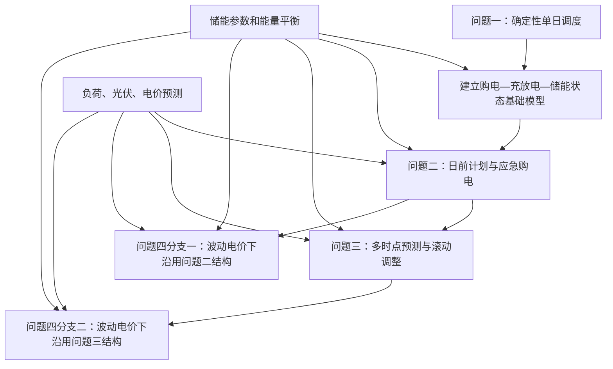
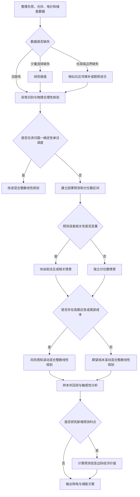

# 数学建模项目记忆文档

> 用途：供后续对话快速恢复本项目上下文。继续工作前，应先读取本文件，并结合 `C题.pdf`、原始附件及已生成的预处理工作簿核验具体数据。

## 一、项目概览

- 赛题：2026 年高教社杯全国大学生数学建模竞赛 C 题《微网与外部电网电力调控策略》。
- 核心任务：在满足小区负荷及储能运行约束的前提下，联合安排外部电网购电与储能充放电，使总购电及相关惩罚成本最小。
- 用户目标：省级一等奖；当前建模路线按冲击国家级一等奖所需的完整性、严谨性和创新性设计。
- 时间粒度：10 分钟，每个功率值换算为该时段电量时乘以 `1/6` 小时。

## 二、项目文件与已有产物

### 原始文件

- `C题.pdf`：题目正文。
- `附件(1).zip`：题目数据附件压缩包。
- `working/`：附件解压及处理中间文件目录。

### 已生成文件

- `outputs/01a08ae9-b1f2-7cb1-8533-3abdadca9c5b/数据预处理结果.xlsx`
  - 包含 10 个工作表：`说明与汇总`、`缺失值汇总`、`异常值汇总`、`异常值明细`、`附件1处理后`、`标准化参数`、`全年实际处理后`、`光伏预测处理后`、`数据补充建议`、`异常检测图表`。
  - 含 4 张可编辑异常检测图。
  - 已验证工作表数量、数据行数、图表数量和公式结果。
  - 原始附件未被覆盖。

## 三、题目结构与各小问关系

- 问题一：确定性单日基础模型，建立物理约束和成本最小化框架。
- 问题二：继承问题一的物理模型，增加每日 0:00 日前购电计划及高价应急购电。
- 问题三：继承问题二，在 0:00、6:00、12:00、18:00 获取光伏预测并滚动调整，同时研究是否值得增加预测时点。
- 问题四：不是简单接在问题三之后，而是包含两个并列分支：波动电价下的问题二结构，以及波动电价下的问题三结构。

## 四、题型分类

| 小问 | 主类型 | 辅助类型 | 判断依据 |
|---|---|---|---|
| 问题一 | 单目标优化 | 机理约束建模 | 决策购电和充放电，使成本最小，并满足储能及功率平衡约束 |
| 问题二 | 单目标优化 | 时序预测、两阶段决策 | 先制订日前计划，实际偏差通过应急购电补救 |
| 问题三 | 单目标优化 | 多阶段滚动决策、预测信息评价 | 多次获得新预测并调整计划，还需评价新增预测时点的经济价值 |
| 问题四 | 单目标优化 | 电价预测、情景分析 | 在波动电价下联合考虑购电时机、储能套利与预测误差 |

说明：成本中即使包含购电费、应急购电费、偏差惩罚等多个部分，仍是一个加总后的单目标优化问题，不属于多目标优化；本题也不属于指标体系评价类。

## 五、统一参数与基础约束

- 储能最大容量：12000 千瓦时。
- 初始储能：2025-01-01 00:00 为 6000 千瓦时。
- 允许运行范围：1200～10800 千瓦时。
- 最大充电功率：5000 千瓦。
- 最大放电功率：5000 千瓦。
- 充放电效率：题目给出 90%，但需明确其含义是单程效率还是往返效率。
- 问题一明确要求 0:00 与 24:00 储能相等。
- 问题二至问题四不应机械地逐日强制首末储能相等，应保持跨日状态连续，并采用全年末状态约束或终端储能价值。
- 必须满足每个时段的供需平衡、储能状态递推、功率上限和储能上下界。
- 建议加入充放电互斥二元变量，避免同一时段同时充电和放电。
- 建议加入弃光变量，并暂定“允许免费弃光、不允许向外部电网售电”；最终论文中应明确该假设。

## 六、整体推荐建模路线

整体框架定为：

> 动态加权分位数预测 → 相关误差情景生成 → 风险感知滚动混合整数线性优化 → 预测信息价值评估

### 1. 动态加权分位数集成预测

- 核心原理：将相似日方法、季节性时间序列模型和梯度提升树的预测结果组合，根据近期误差、季节、时刻和预测步长动态调整权重，并输出多个分位数而非单一预测值。
- 适配性：负荷、光伏和电价均具有明显日周期、季节性和短期波动；分位数预测能描述不确定性，并配合高额应急购电成本采取偏保守计划。
- 创新点：采用随时段和预测步长变化的动态权重；对负荷使用偏高分位数、对光伏使用偏低分位数，以体现上下偏差成本不对称。
- 局限性：极端天气样本不足时，尾部分位数不稳定；相似日和树模型也会受外部特征缺失影响。

### 2. 基于残差块自助法的相关情景生成

- 核心原理：从历史预测残差中按连续时间块抽样，构造多条可能的负荷、光伏和电价路径，再通过聚类压缩为少量代表性情景。
- 适配性：储能调度受连续多个时段误差累积影响，独立随机误差无法反映阴云持续、负荷高峰延续等相关性。
- 创新点：保留时间相关性，并可进一步保留负荷、光伏和电价之间的联合相关性；情景缩减兼顾真实性和计算效率。
- 局限性：历史中未出现过的结构性极端事件难以被重现；情景数量过少会损失尾部风险，过多则增加求解时间。

### 3. 风险感知滚动混合整数线性规划

- 核心原理：在每个可决策时点，根据最新预测重新优化剩余时段的购电及储能计划，只执行最近一段决策；利用二元变量保证充放电互斥，并将平均成本与尾部风险共同纳入目标。
- 适配性：问题三天然是多阶段滚动决策，问题二和问题四也可作为该框架的简化版本；线性结构便于得到可解释、可复现的全局最优解。
- 创新点：加入动态安全储能下限、条件风险价值、终端储能价值以及小额电池等效循环成本，避免模型透支未来储能或频繁无效充放电。
- 局限性：混合整数变量和多情景会增加计算量；结果对预测分布、风险系数及终端价值参数较敏感。

### 4. 预测信息价值评估模型

- 核心原理：比较增加某个预测时点前后的期望总成本差，只有预计节约超过调整费用或偏差惩罚时，才认为该时点具有实际经济价值。
- 适配性：直接回答问题三“是否需要增加预测时点”，避免只用预测误差下降来替代经济效益判断。
- 创新点：用调度成本的边际改善衡量预测价值，并给出置信区间，而非仅比较均方误差。
- 局限性：若题目没有给出获取额外预测的成本，只能先计算理论价值，再对不同信息成本做敏感性分析。

### 模型使用决策流程

## 七、问题一模型对比与最终选择

| 模型 | 优点 | 主要不足 | 定位 |
|---|---|---|---|
| 线性规划 | 求解快、全局最优、结构清晰 | 难以严格禁止同一时段同时充放电 | 基准模型和成本下界 |
| 混合整数线性规划 | 可通过二元变量严格表达充放电互斥，结果精确且便于扩展 | 计算量略高于线性规划 | 正式主模型，综合最优 |
| 动态规划 | 状态转移直观，适合独立验证储能策略 | 储能离散带来误差，扩展后有维数灾难 | 典型日稳健性验证 |
| 遗传算法等启发式算法 | 易处理复杂非凸目标 | 无法保证全局最优、参数依赖强、复现性较弱 | 不建议作为主模型 |

问题一最终推荐：采用“含充放电互斥、弃光变量、终端储能相等约束及小额循环成本的改进混合整数线性规划”。线性规划作为下界对照，动态规划作为独立验证。深度学习、强化学习和遗传算法不宜作为本题主线模型。

## 八、各问题的主要成本规则

- 问题一：按给定电价计算外部电网购电成本，满足单日首末储能相等。
- 问题二：每天 0:00 制订计划；实际缺口通过应急购电弥补，应急购电价格为交易时刻电价的 5 倍。
- 问题三：在 0:00、6:00、12:00、18:00 获得新预测并调整计划；下调部分按交易电价的 0.5 倍承担偏差成本，上调新增电量按交易电价的 1.5 倍计费。需仔细建立结算口径，避免重复计价。
- 问题四：将固定或给定电价替换为波动电价，并分别嵌入问题二、问题三结构。

## 九、数据结构与预处理结论

### 数据规模

- 附件 1：1 个工作表，144 条 10 分钟记录，包含时刻、电价、小区负荷、光伏预测功率；数值完整。
- 附件 2：2 个工作表，分别为小区负载和光伏发电实际功率；各为 `365×144`，合并后共 52560 个时间点。
- 附件 3：365 天、每天 4 个预测发布时间，共 1460 行；每次含未来 24 小时逐小时预测，长表化后共 35040 条记录。
- 附件 4：365 天、每天 144 个时间点，共 52560 条波动电价记录。

### 缺失值

- 数值型缺失值为 0。
- 附件 3 中有 1095 个日期空白单元格，是同一天 6:00、12:00、18:00 行省略或合并日期造成的结构性空白，已向下填充日期。
- 年末有 36 个预测目标时刻超出附件 2 实际光伏数据范围，对应实际值保持为空，并从预测误差评估中排除。
- 后续若出现缺失：不超过 3 个连续 10 分钟内部缺口用线性插值；更长或边界缺口用相似日近邻填补；超过 2 小时或整日缺失时优先追溯原数据或剔除该日，不使用全局均值填补。

### 异常值

- 采用四分位距法检测。
- 附件 1：0 个候选异常。
- 全年负荷：8 个候选异常，占约 0.02%。
- 全年实际光伏：564 个候选异常，占约 1.07%。
- 波动电价：236 个候选异常，占约 0.45%。
- 光伏预测：253 个候选异常，占约 0.72%。
- 合计候选异常：1061 个。
- 附件 1 按变量整体检测；全年数据按同月、同时刻分组检测；预测数据按月份、发布时间和预测步长分组检测。
- 所有候选异常均保留并加标记，未直接删除或修正，因为这些数值可能对应真实负荷峰值、云层扰动或电价跳变。建模时应通过稳健损失、情景法或敏感性分析降低其影响。

### 数据转换

- 优化模型继续使用千瓦、千瓦时和电价原始物理单位，不进行标准化。
- 距离类及机器学习预测模型采用标准分数标准化：`标准值 =（原值－训练集均值）/训练集标准差`。
- 标准化参数仅用 1 月训练数据计算，避免未来数据泄漏。
- 未采用极差归一化，因为极端值会明显改变范围，且调度模型需要保留物理量纲。
- 已构造日内时刻和年内日期的正余弦周期特征。
- 已构造 10 分钟电量字段：`电量 = 功率/6`。

## 十、必须明确的假设与补充信息

### 必须补充或在论文中明确

1. 90% 是充电与放电各自的单程效率，还是电池总往返效率。
2. 是否允许弃光；是否允许向外部电网售电。
3. 外部电网是否存在最大购电功率。
4. 每个决策时点能够获得哪些信息，尤其是问题二和问题四是否提前知道未来负荷、电价。
5. 问题三调整购电量的精确结算规则，以避免原计划电量与增减量重复计费。
6. 问题二至问题四的年末储能状态或终端储能价值规则。
7. 新增预测时点是否存在信息获取成本。

### 无法获得官方补充时的建议假设

- 主方案将充电效率和放电效率均设为 90%，并把“90% 为往返效率”作为敏感性方案。
- 允许免费弃光，不允许向外部电网售电。
- 若题目未给购电功率上限，则主模型暂不设上限，并增加有限上限的敏感性分析。
- 所有预测严格遵守因果性，只使用当时及以前可获得的数据。
- 问题二至问题四保持储能跨日连续，采用全年首末状态相等或终端价值处理。
- 新增预测时点先按零获取成本计算理论信息价值，再改变信息成本进行敏感性分析。

### 可选外部数据

- 温度、云量、太阳辐照度和降水等天气数据。
- 工作日、周末、法定节假日和特殊活动信息。
- 电池循环寿命、衰减曲线和等效循环成本。
- 电价发布机制及实际结算规则。

## 十一、结果文件要求

- `result1.xlsx`：问题一每 10 分钟计划购电量、充放电汇总及 0:00/24:00 储能状态。
- `result2.xlsx`：问题二 2 月 1 日至 12 月 31 日的计划购电、充放电和应急购电时段。
- `result3.xlsx`：问题三计划购电、调整后购电、最终充放电及最终应急购电。
- `result4-2.xlsx`：问题四中采用问题二结构的结果。
- `result4-3.xlsx`：问题四中采用问题三结构的结果。
- 论文重点展示日期：2025-03-20、2025-06-21、2025-09-23、2025-12-21。

## 十二、后续工作优先级

1. 从题目原文再次核对效率、售电、弃光、购电上限和结算规则，固定建模假设。
2. 先实现问题一改进混合整数线性规划，输出 `result1.xlsx`，并用线性规划或动态规划交叉验证。
3. 按时间顺序划分训练集和测试集，建立负荷、光伏及必要时的电价基准预测模型。
4. 实现问题二的日前计划—应急补救模型，确保只使用决策时点可获得的信息。
5. 实现问题三的四阶段滚动优化和预测信息价值评估。
6. 将波动电价嵌入问题二、问题三框架完成问题四。
7. 统一进行样本外回测、敏感性分析、消融实验和典型日期可视化。

## 十三、论文创新与验证建议

- 创新主线控制在 2～3 个核心点：动态不对称分位数、相关情景生成、动态风险储能或预测信息价值。
- 至少设置以下对照：无储能、规则调度、确定性线性规划、确定性混合整数线性规划、风险感知滚动模型。
- 报告指标包括：总成本、应急购电成本、应急购电量、弃光率、储能循环次数、尾部成本、求解时间。
- 做关键参数敏感性分析：效率、初始储能、容量、功率上限、应急价格倍数、风险权重、终端价值和预测误差。
- 做消融实验，分别移除动态权重、相关情景、风险项和终端价值，证明各改进模块的实际贡献。

## 十四、下一段对话的接续提示

新对话开始时，可直接要求助手：

> 请先读取项目根目录的《项目记忆.md》和预处理工作簿，在已有模型选择与数据结论基础上继续，不要重新从零分析。当前优先任务是：〔填写问题一建模、代码实现、结果表生成或论文撰写等〕。

若记忆文档与题目原文、实际数据或后续计算结果冲突，应以重新核验后的题目与数据为准，并同步更新本文件。
